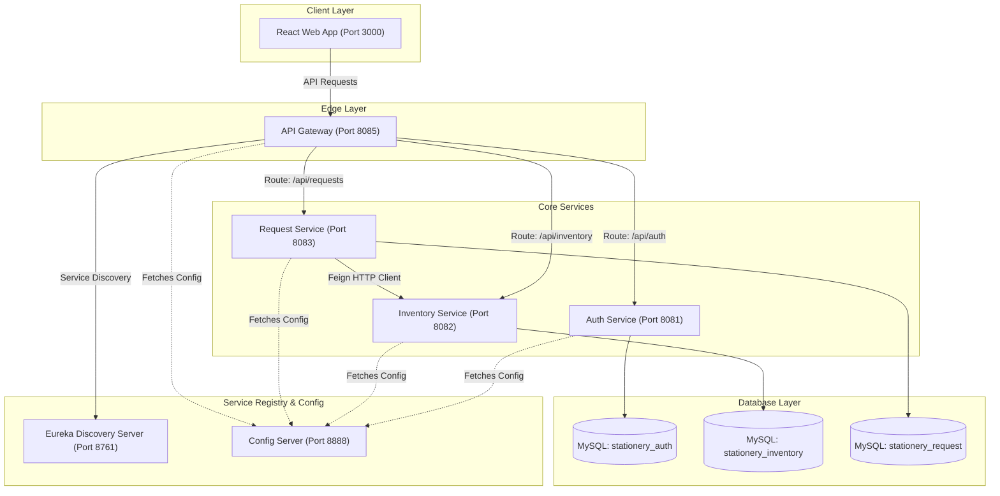

# 📚 Stationery Management System

The **Stationery Management System** is a full-stack, microservices-based web application designed to streamline stationery inventory and request operations. 

* **Students** can log in, browse the real-time catalog, submit requests for stationery items, and track their request status.
* **Administrators** can manage the product catalog, update stock counts, view detailed transaction logs, and approve/reject requests. Approved requests automatically trigger real-time stock deductions.

---

## 🏗️ System Architecture

This project is built using a decentralized **Microservices Architecture** to ensure loose coupling, independent scalability, and high availability.



### 1. Backend Core Services
* **API Gateway (`api-gateway`)**: The unified entryway for all client requests. It handles routing and applies CORS filters.
* **Eureka Discovery Server (`eureka-server`)**: Serves as the service registry, allowing microservices to discover and communicate with one another dynamically.
* **Config Server (`config-server`)**: The centralized configuration hub. It hosts native property files (`.yml`) from the local `/config-repo` directory and serves them to all downstream microservices on startup.
* **Auth Service (`auth-service`)**: Manages user accounts, performs BCrypt password hashing, and generates JWT tokens (Access and Refresh) for secure communication.
* **Inventory Service (`inventory-service`)**: Owns the item catalog and handles stock increments, low-stock notifications, and transactional deductions.
* **Request Service (`request-service`)**: Manages the request lifecycle (Pending, Approved, Rejected, Fulfilled). Communicates with the Inventory Service via **OpenFeign** during the approval phase to deduct stock.

### 2. Frontend Layer
* **React + Vite App**: A single-page application built with React, TailwindCSS, and Axios. It features separate, responsive dashboards for students and administrators, guarded by secure client-side routing.

### 3. Database Layer (Database-per-Service)
Following microservice design principles, databases are isolated:
* `stationery_auth` for identity and account management.
* `stationery_inventory` for item specifications and current stock volumes.
* `stationery_request` for requests and audit log metrics.

---

## 🛠️ Technology Stack

* **Frontend**: React 18, Vite, React Router, Axios, TailwindCSS
* **Backend**: Java 17, Spring Boot 3.2.4, Spring Cloud (Gateway, Eureka Discovery, OpenFeign, Config Server)
* **Security**: Spring Security, JWT (JSON Web Tokens), BCrypt
* **Database**: MySQL 8.0
* **Testing**: JUnit 5, Mockito
* **Infrastructure**: Docker, Docker Compose, Jenkins, SonarQube

---

## ⚙️ Centralized Configuration (Config Server)

Centralized properties are stored in [backend/config-repo](file:///c:/Users/asus/OneDrive/Desktop/Sprint/stationery-management-system/backend/config-repo) and served by the `config-server` on port `8888`. 

Downstream microservices import configurations on boot using Spring Cloud Config:
```yaml
spring:
  config:
    import: "configserver:http://config-server:8888/"
```
This design isolates database credentials, Eureka paths, and JWT secrets outside the application binary, enabling changes without rebuilding service code.

---

## 🚀 Running the Project

### Prerequisites
* **Docker** and **Docker Compose** installed on your system.
* **Java 17** and **Maven 3.x** (optional, for local compilations).

### Multi-Container Startup
Run the following command at the root of the project to compile the code, build the container images, and start the system:

```bash
docker compose up -d --build
```

#### Deterministic Startup Order & Healthchecks
To avoid start-up race conditions (e.g., microservices booting before the Config Server or Eureka Registry are online), the [docker-compose.yml](file:///c:/Users/asus/OneDrive/Desktop/Sprint/stationery-management-system/docker-compose.yml) enforces a strict healthcheck sequence:
1. **MySQL** starts.
2. **Config Server** starts and is polled using health checks (`http://localhost:8888/application/default`) until ready.
3. **Eureka Server** starts once Config Server is healthy, checking readiness via `http://localhost:8761/`.
4. **Microservices** (`api-gateway`, `auth-service`, `inventory-service`, `request-service`) start in parallel only after both Config and Eureka servers pass health checks.
5. **Frontend** starts once the API Gateway acts healthy on `http://localhost:8080/actuator/health`.

### Accessing the Applications
* **Frontend Portal**: `http://localhost:3000`
* **Eureka Registry Dashboard**: `http://localhost:8761`
* **API Gateway Port**: `http://localhost:8085` (external mapping)
* **Config Server Endpoint**: `http://localhost:8888`

---

## 🧪 Testing & Code Quality

* **Automated Tests**: To run unit and service integration tests locally, navigate to the `backend/` folder and run:
  ```bash
  mvn clean test
  ```
* **CI/CD Pipeline**: A declarative [Jenkinsfile] is configured to automatically pull the code, compile/test the services, construct Docker images, run SonarQube analyses, and deploy the application.
* **SonarQube Analysis**: Code coverage and quality metrics are managed via [sonarqube/sonar-project.properties]
