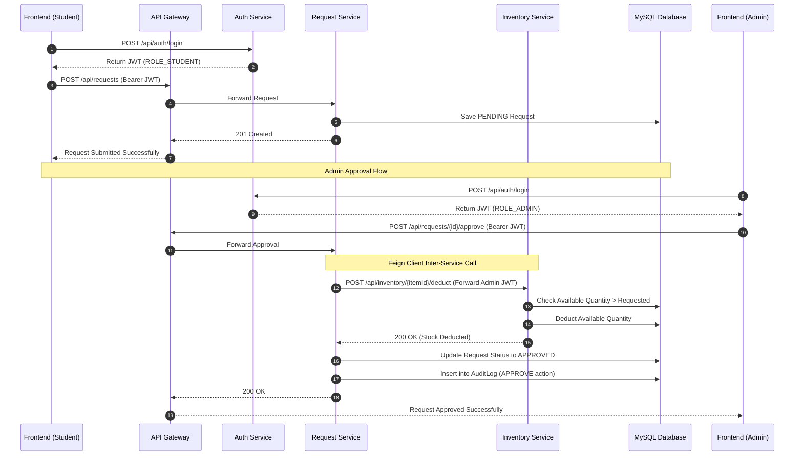

# API Contracts & Data Flow

This document details the exact flow of data through the API endpoints and illustrates the sequence of operations for the core business workflows.

## API Architectural Sequence

The most complex flow in the system is the **Request Approval Workflow**, which involves a student submitting a request, an admin approving it, and cross-service communication to manage stock.

## Core API Endpoints

### 1. Authentication Service (`/api/auth`)
*   **`POST /register`**: Registers a new user. Expects `email`, `password`, `fullName`, and `role`. Returns a JWT.
*   **`POST /login`**: Authenticates a user. Expects `email` and `password`. Returns a JWT.

### 2. Inventory Service (`/api/inventory`)
*   **`GET /`**: Returns a paginated list of all items. Accessible by Admins and Students.
*   **`POST /`**: Creates a new stationery item. Admin only.
*   **`PUT /{id}`**: Updates item details. Admin only.
*   **`DELETE /{id}`**: Removes an item. Admin only.
*   **`GET /low-stock`**: Returns items where available quantity <= minimum quantity. Admin only.
*   **`POST /{id}/deduct`**: Internal endpoint used by Feign Client to reduce stock.

### 3. Request Service (`/api/requests`)
*   **`POST /`**: Submits a request containing a list of item IDs and quantities. Student only.
*   **`GET /me`**: Returns the logged-in student's personal request history. Student only.
*   **`GET /`**: Returns all system requests. Admin only.
*   **`POST /{id}/approve`**: Approves a pending request and deducts inventory stock. Admin only.
*   **`POST /{id}/reject`**: Rejects a pending request (requires a `reason` query param). Admin only.
*   **`POST /{id}/fulfill`**: Marks an approved request as physically fulfilled. Admin only.

## Error Handling
All APIs use a standard `@RestControllerAdvice` to catch exceptions (e.g., `ResourceNotFoundException`, `DuplicateResourceException`) and return a structured JSON error response containing the timestamp, HTTP status code, and a descriptive message.
