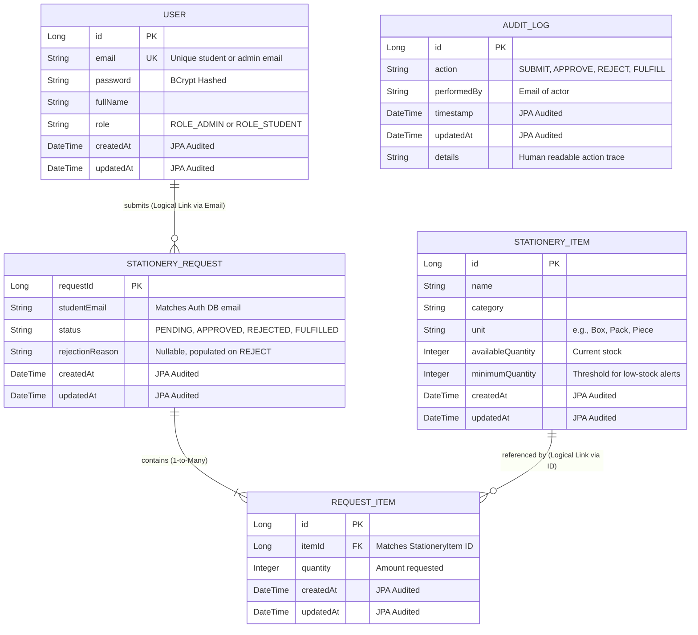

# Database Schema & Entity Relationships

The system employs a strict Database-per-Service pattern. Each microservice manages its own isolated MySQL database, ensuring loose coupling and independent scalability.

## Entity Relationship Diagram (ERD)

## Database Breakdown

### 1. Auth Database (`stationery_auth`)
Contains the `users` table. 
*   **Security:** Passwords are never stored in plaintext. They are encoded using BCrypt.
*   **Integrity:** The `email` column has a unique constraint to prevent duplicate registrations.

### 2. Inventory Database (`stationery_inventory`)
Contains the `stationery_items` table.
*   **Stock Tracking:** Maintains `availableQuantity`. The `minimumQuantity` column acts as a trigger point for the low-stock alert API.

### 3. Request Database (`stationery_request`)
Contains three tables: `requests`, `request_items`, and `audit_logs`.
*   **Normalization:** A `STATIONERY_REQUEST` can have multiple `REQUEST_ITEM`s (e.g., requesting 5 Pens and 2 Notebooks in one go). This is handled via a `@OneToMany` relationship with `CascadeType.ALL`.
*   **Foreign Key Constraints:** The `request_items` table stores `item_id`. Because `items` live in a different database, this is a "soft" logical foreign key rather than a hard database-level constraint.

## JPA Auditing
Across all tables, we utilize **Spring Data JPA Auditing**. 
*   Entities are annotated with `@EntityListeners(AuditingEntityListener.class)`.
*   The `createdAt` field is annotated with `@CreatedDate` (immutable after creation).
*   The `updatedAt` field is annotated with `@LastModifiedDate` (updates automatically on every row modification).
