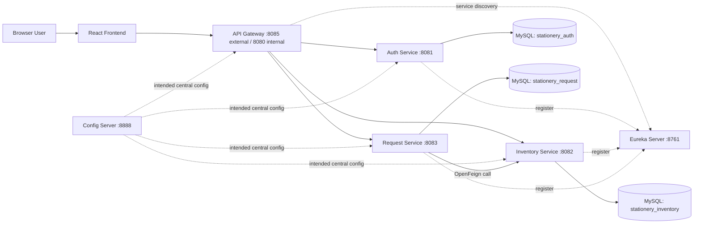
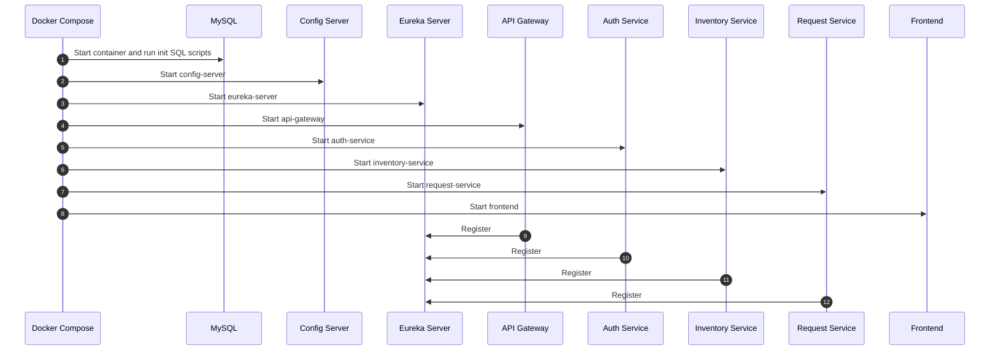
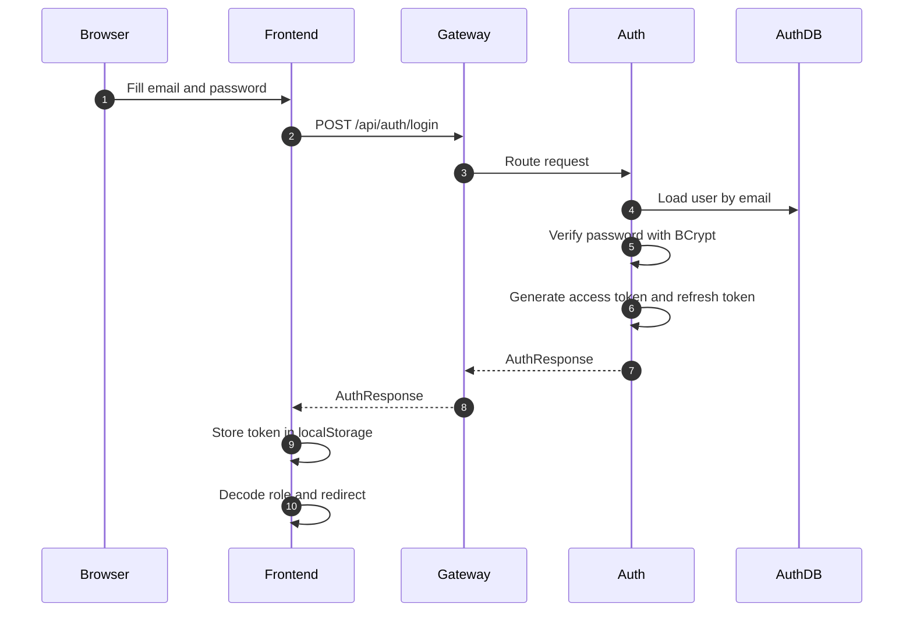
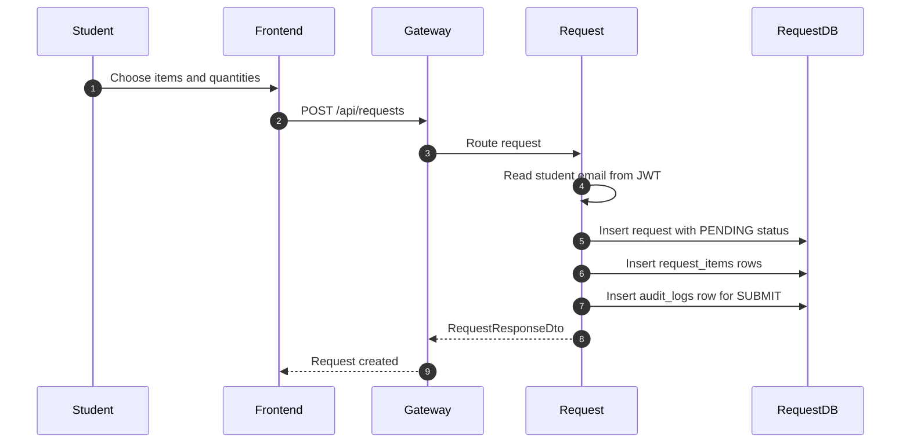
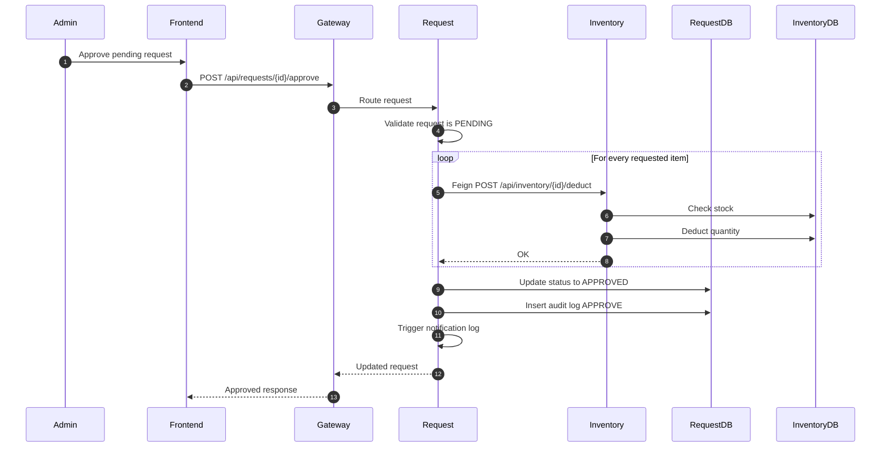
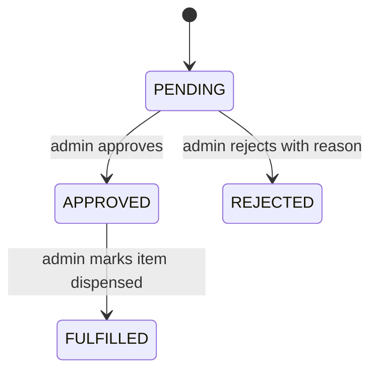
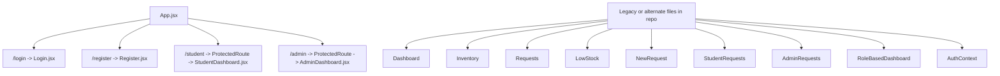
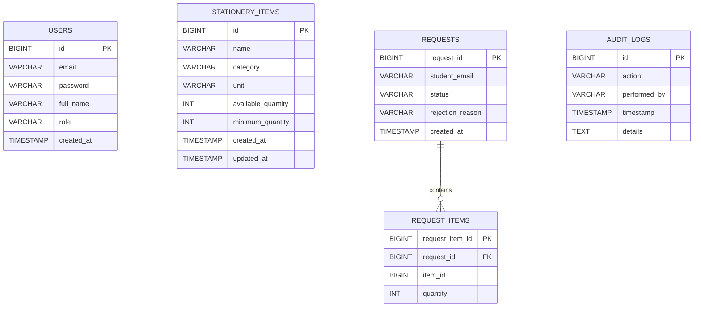

# Stationery Management System Documentation

## 1. Introduction

The Stationery Management System is a full-stack microservices application for managing university or school stationery operations.

At a business level, the system solves three problems:

1. Users need a way to register and log in.
2. Students need a way to browse available stationery and submit requests.
3. Administrators need a way to manage stock, approve or reject requests, and mark approved requests as fulfilled.

Technically, the solution is split into:

- A React frontend built with Vite
- A Spring Boot backend split into multiple services
- MySQL databases, one per business service
- An API Gateway for a single external entry point
- Eureka for service discovery
- A Config Server module for centralized config, although the current repository does not fully wire it into runtime
- Docker Compose for local multi-container startup
- Jenkins and SonarQube support for CI/CD and code analysis

This document explains:

- What every major part of the project does
- How requests move through the system
- How the backend services collaborate
- How the frontend is structured
- What each tracked file is responsible for
- Which parts are active, which parts are legacy, and where the current design has mismatches

## 2. Repository Overview

```text
stationery-management-system/
|-- backend/
|   |-- pom.xml
|   |-- InventoryApiTest.java
|   |-- api-gateway/
|   |-- auth-service/
|   |-- config-server/
|   |-- eureka-server/
|   |-- inventory-service/
|   `-- request-service/
|-- frontend/
|   |-- package.json
|   |-- vite.config.js
|   |-- Dockerfile
|   |-- test.cjs
|   |-- public/
|   `-- src/
|-- mysql/
|   |-- auth-db-init.sql
|   |-- inventory-db-init.sql
|   `-- request-db-init.sql
|-- docs/
|   |-- architecture.md
|   |-- architecture.png
|   |-- api-contracts.md
|   |-- database-schema.md
|   `-- audit-logging.md
|-- sonarqube/
|   `-- sonar-project.properties
|-- docker-compose.yml
|-- Jenkinsfile
`-- documentation.md
```

## 3. High-Level Architecture

### 3.1 Architecture Diagram



### 3.2 Architectural Meaning

- The frontend never calls internal services directly. It always calls the API Gateway.
- The API Gateway routes incoming requests based on URL path.
- Auth Service manages identity and JWT token generation.
- Inventory Service manages stock and low-stock monitoring.
- Request Service manages student requests and their lifecycle.
- Request Service talks to Inventory Service during approval, because approval is the moment stock is actually deducted.
- Each business service has its own MySQL database, which keeps service ownership clear.
- Eureka allows services to find one another by service name instead of hardcoded host and port values.
- Config Server exists in the repository as infrastructure, but the current application code mostly uses local `application.yml` files directly.

## 4. End-to-End Runtime Flow

### 4.1 System Startup Flow



### 4.2 Login Flow



### 4.3 Student Request Submission Flow



### 4.4 Admin Approval Flow



### 4.5 Rejection and Fulfillment State Machine



## 5. Backend Deep Dive

## 5.1 Backend Parent Module

### File: `backend/pom.xml`

Purpose:

- This is the Maven aggregator for the backend.
- Packaging is `pom`, which means it does not build an application by itself.
- It lists all backend modules:
  - `config-server`
  - `eureka-server`
  - `api-gateway`
  - `auth-service`
  - `inventory-service`
  - `request-service`

Why it matters:

- Running Maven commands from `backend/` builds all services together.
- Jenkins uses this parent structure to run `mvn clean verify` once over the backend.

## 5.2 Config Server Module

### What the module is for

The Config Server is intended to provide centralized configuration to all microservices using Spring Cloud Config.

### File: `backend/config-server/pom.xml`

Purpose:

- Declares the module as a Spring Boot application.
- Adds `spring-cloud-config-server`.
- Uses Java 17 and Spring Cloud 2023.0.1.

### File: `backend/config-server/src/main/java/com/stationery/config/ConfigServerApplication.java`

Main class behavior:

- `main(...)`: starts the Spring Boot Config Server process.
- `@EnableConfigServer`: turns this app into a config server.

### File: `backend/config-server/src/main/resources/application.yml`

What it does:

- Runs on port `8888`.
- Uses Spring profile `native`.
- Looks for configuration files in `file:../config-repo`.
- Disables Eureka client behavior to avoid circular startup dependency.

Important note:

- The repository does not currently contain a `config-repo` folder.
- The business services also do not show `spring.config.import=configserver:` wiring.
- So the config server exists architecturally, but the current checked-in runtime behavior mostly relies on local `application.yml` files in each service.

### File: `backend/config-server/Dockerfile`

Purpose:

- Packages a built JAR into a lightweight Java container.
- Exposes port `8888`.

## 5.3 Eureka Server Module

### What the module is for

Eureka is the service registry. It lets services find each other by logical service name.

### File: `backend/eureka-server/pom.xml`

Purpose:

- Adds `spring-cloud-starter-netflix-eureka-server`.
- Uses Spring Boot and Spring Cloud versions aligned with the other modules.

### File: `backend/eureka-server/src/main/java/com/stationery/eureka/EurekaServerApplication.java`

Main class behavior:

- `main(...)`: boots the registry.
- `@EnableEurekaServer`: enables Eureka server behavior.

### File: `backend/eureka-server/src/main/resources/application.yml`

What it does:

- Runs on port `8761`.
- Sets hostname to `localhost`.
- Prevents the registry from registering with itself.
- Prevents the registry from fetching its own registry data.

### File: `backend/eureka-server/Dockerfile`

Purpose:

- Packages the registry as a runnable container.

## 5.4 API Gateway Module

### What the module is for

The API Gateway is the single backend entry point for the frontend.

### File: `backend/api-gateway/pom.xml`

Purpose:

- Adds Spring Cloud Gateway.
- Adds Eureka client support.
- Adds Spring Boot Actuator for health/info endpoints.

### File: `backend/api-gateway/src/main/java/com/stationery/gateway/ApiGatewayApplication.java`

Main class behavior:

- `main(...)`: starts the gateway.
- `@EnableDiscoveryClient`: registers with Eureka and consumes registry data.

### File: `backend/api-gateway/src/main/java/com/stationery/gateway/config/CorsConfig.java`

Purpose:

- Allows the browser frontend to call gateway endpoints from local development origins.

Important function:

- `corsWebFilter()`
  - Creates a `CorsConfiguration`
  - Allows `http://localhost:*` and `http://127.0.0.1:*`
  - Allows methods `GET`, `POST`, `PUT`, `DELETE`, `OPTIONS`, `PATCH`
  - Allows headers `Authorization`, `Content-Type`, `Accept`
  - Enables credentials
  - Registers CORS rules for all routes

### File: `backend/api-gateway/src/main/resources/application.yml`

Routing behavior:

- Gateway listens on port `8080` internally.
- Path rules:
  - `/api/auth/**` -> `lb://auth-service`
  - `/api/inventory/**` -> `lb://inventory-service`
  - `/api/requests/**` -> `lb://request-service`
- `lb://` means "load-balance and resolve via service discovery".
- Exposes `health` and `info` actuator endpoints.

### File: `backend/api-gateway/Dockerfile`

Purpose:

- Runs the built gateway JAR in a container.

## 5.5 Auth Service Module

### What the module is for

This service owns users, login, registration, password hashing, and JWT creation.

### Package and file responsibilities

#### File: `backend/auth-service/pom.xml`

Dependencies and why they exist:

- `spring-boot-starter-web`: REST endpoints
- `spring-boot-starter-data-jpa`: ORM and repository support
- `mysql-connector-j`: MySQL driver
- `spring-boot-starter-security`: authentication and authorization
- `spring-boot-starter-validation`: DTO validation
- `spring-cloud-starter-netflix-eureka-client`: service registration
- `jjwt-*`: JWT creation and parsing
- `lombok`: logging boilerplate reduction
- `spring-boot-starter-test`: unit testing

#### File: `backend/auth-service/src/main/java/com/stationery/auth/AuthServiceApplication.java`

Purpose:

- Boot entry point for auth-service.

Annotations:

- `@SpringBootApplication`: enables component scanning and auto-configuration
- `@EnableDiscoveryClient`: registers with Eureka
- `@EnableJpaAuditing`: enables automatic `createdAt` and `updatedAt` handling

Function:

- `main(...)`: starts the auth service process.

#### File: `backend/auth-service/src/main/resources/application.yml`

What it configures:

- Port `8081`
- Database `stationery_auth`
- JPA with `ddl-auto: update`
- Service name `auth-service`
- Eureka client default zone
- JWT secret
- Access token expiration

How it works:

- Uses environment-variable fallbacks like `DB_HOST`, `DB_PORT`, `DB_USER`, `DB_PASS`.
- The JWT secret is shared with downstream services so they can validate tokens.

#### File: `backend/auth-service/src/main/java/com/stationery/auth/entity/User.java`

Purpose:

- JPA entity for the `users` table.

Fields:

- `id`: primary key
- `email`: unique login identifier
- `password`: BCrypt hash
- `fullName`: display name
- `role`: string role such as `ROLE_ADMIN`
- `createdAt`, `updatedAt`: audit timestamps

Behavior:

- Contains standard getters and setters only.
- No domain logic lives in the entity itself.

#### File: `backend/auth-service/src/main/java/com/stationery/auth/entity/Role.java`

Purpose:

- Enum listing supported roles:
  - `ROLE_STUDENT`
  - `ROLE_ADMIN`

Note:

- The code mostly stores role values as strings, so the enum is descriptive but not deeply integrated into persistence.

#### File: `backend/auth-service/src/main/java/com/stationery/auth/repository/UserRepository.java`

Purpose:

- Data access layer for `User`.

Methods:

- `findByEmail(String email)`: used during login and refresh-token flow
- `existsByEmail(String email)`: used to block duplicate registration

#### File: `backend/auth-service/src/main/java/com/stationery/auth/dto/AuthRequest.java`

Purpose:

- Login payload.

Fields:

- `email`
- `password`

Validation:

- Both are required.

#### File: `backend/auth-service/src/main/java/com/stationery/auth/dto/RegisterRequest.java`

Purpose:

- Registration payload.

Fields:

- `email`
- `password`
- `fullName`
- `role`

Validation:

- Email format check
- Minimum password length of 6
- Required full name and role

#### File: `backend/auth-service/src/main/java/com/stationery/auth/dto/AuthResponse.java`

Purpose:

- Response returned after login, registration, or refresh.

Fields:

- `token`
- `refreshToken`
- `email`
- `fullName`
- `role`

#### File: `backend/auth-service/src/main/java/com/stationery/auth/dto/RefreshTokenRequest.java`

Purpose:

- Payload for the refresh endpoint.

Field:

- `refreshToken`

#### File: `backend/auth-service/src/main/java/com/stationery/auth/security/CustomUserDetailsService.java`

Purpose:

- Adapter from application user records to Spring Security's `UserDetails`.

Important function:

- `loadUserByUsername(String username)`
  - Looks up the user by email
  - Throws `UsernameNotFoundException` if absent
  - Returns Spring Security `User` with email, password hash, and one authority derived from stored role

#### File: `backend/auth-service/src/main/java/com/stationery/auth/security/JwtUtil.java`

Purpose:

- Central JWT creation and validation utility.

Important functions:

- `extractUsername(token)`: gets subject from token
- `extractClaim(token, resolver)`: generic claim extraction helper
- `extractAllClaims(token)`: parses signed token
- `extractExpiration(token)`: reads expiry time
- `validateToken(token, userDetails)`: verifies username match and expiration
- `generateToken(userDetails)`: builds access token including role claim
- `generateRefreshToken(userDetails)`: builds refresh token without role claim

How it works:

- Uses HMAC signing via `Keys.hmacShaKeyFor(secret.getBytes())`
- Stores the user's email as the JWT subject
- Stores role inside custom claim `role`

Why the role claim matters:

- Inventory and Request services can enforce role-based access without querying the auth database for every request.

#### File: `backend/auth-service/src/main/java/com/stationery/auth/security/SecurityConfig.java`

Purpose:

- Configures Spring Security for auth-service.

Important functions:

- `securityFilterChain(HttpSecurity http)`
  - Disables CSRF
  - Allows unauthenticated access to `/api/auth/register`, `/api/auth/login`, and `/actuator/**`
  - Requires authentication for everything else
  - Uses stateless session management
  - Registers the custom authentication provider

- `authenticationProvider()`
  - Creates a `DaoAuthenticationProvider`
  - Uses `CustomUserDetailsService`
  - Uses BCrypt password encoder

- `authenticationManager(AuthenticationConfiguration config)`
  - Exposes Spring's authentication manager for programmatic login

- `passwordEncoder()`
  - Returns a BCrypt encoder

Important note:

- `AuthController` exposes `/api/auth/refresh`, but `SecurityConfig` does not explicitly permit that path.
- That means the refresh endpoint exists in code but may not be reachable anonymously under the current rules.

#### File: `backend/auth-service/src/main/java/com/stationery/auth/service/AuthService.java`

Purpose:

- Business interface for auth operations.

Methods:

- `register(RegisterRequest request)`
- `login(AuthRequest request)`
- `refreshToken(RefreshTokenRequest request)`

#### File: `backend/auth-service/src/main/java/com/stationery/auth/service/impl/AuthServiceImpl.java`

Purpose:

- Implements all auth workflows.

Important functions:

- `register(RegisterRequest request)`
  - Checks if email already exists
  - Builds a new `User`
  - Hashes password with BCrypt
  - Saves user
  - Loads user details
  - Generates access token and refresh token
  - Returns `AuthResponse`

- `login(AuthRequest request)`
  - Uses `AuthenticationManager` to verify credentials
  - Loads stored user
  - Generates access token and refresh token
  - Returns `AuthResponse`

- `refreshToken(RefreshTokenRequest request)`
  - Reads the submitted refresh token
  - Extracts username
  - Loads user details
  - Validates refresh token
  - Generates a new access token and a new refresh token
  - Reloads user profile and returns `AuthResponse`

Design choice:

- The service auto-logs users in after registration by returning tokens immediately.

#### File: `backend/auth-service/src/main/java/com/stationery/auth/controller/AuthController.java`

Purpose:

- REST controller for auth endpoints.

Important functions:

- `register(...)`
  - Endpoint: `POST /api/auth/register`
  - Accepts validated registration payload
  - Delegates to `authService.register`
  - Returns `201 Created`

- `login(...)`
  - Endpoint: `POST /api/auth/login`
  - Accepts validated login payload
  - Delegates to `authService.login`
  - Returns `200 OK`

- `refresh(...)`
  - Endpoint: `POST /api/auth/refresh`
  - Accepts refresh token payload
  - Delegates to `authService.refreshToken`
  - Returns `200 OK`

#### File: `backend/auth-service/src/main/java/com/stationery/auth/exception/DuplicateResourceException.java`

Purpose:

- Custom exception used when registration tries to reuse an existing email.

#### File: `backend/auth-service/src/main/java/com/stationery/auth/exception/GlobalExceptionHandler.java`

Purpose:

- Maps exceptions into consistent JSON responses.

Important functions:

- `handleDuplicateResource(...)`: returns `409 Conflict`
- `handleBadCredentials(...)`: returns `401 Unauthorized`
- `handleValidationExceptions(...)`: returns `400 Bad Request`
- `handleGenericException(...)`: returns `500 Internal Server Error`

#### File: `backend/auth-service/Dockerfile`

Purpose:

- Packages the service JAR into a container exposing port `8081`.

#### File: `backend/auth-service/src/test/java/com/stationery/auth/service/impl/AuthServiceImplTest.java`

What it tests:

- Successful registration
- Duplicate-email registration failure
- Successful login

Why it matters:

- Confirms core service logic works without starting the whole application.

## 5.6 Inventory Service Module

### What the module is for

This service owns item CRUD, stock levels, low-stock detection, and stock deduction.

#### File: `backend/inventory-service/pom.xml`

Dependencies:

- Web, JPA, MySQL, Security, Validation, Eureka client, JWT libs, Lombok, testing

#### File: `backend/inventory-service/src/main/java/com/stationery/inventory/InventoryServiceApplication.java`

Purpose:

- Boot entry point.
- Registers with Eureka.
- Enables JPA auditing.

Function:

- `main(...)`: starts the inventory service.

#### File: `backend/inventory-service/src/main/resources/application.yml`

What it configures:

- Port `8082`
- Database `stationery_inventory`
- JPA auto-update
- Service name `inventory-service`
- Shared JWT secret

#### File: `backend/inventory-service/src/main/java/com/stationery/inventory/entity/StationeryItem.java`

Purpose:

- JPA entity for `stationery_items`.

Fields:

- `id`
- `name`
- `category`
- `unit`
- `availableQuantity`
- `minimumQuantity`
- `createdAt`
- `updatedAt`

Behavior:

- Getter/setter entity only.

#### File: `backend/inventory-service/src/main/java/com/stationery/inventory/dto/StationeryItemDto.java`

Purpose:

- API payload and response model for item data.

Validation:

- `name`, `category`, `unit` required
- `availableQuantity` and `minimumQuantity` required and non-negative

#### File: `backend/inventory-service/src/main/java/com/stationery/inventory/repository/StationeryItemRepository.java`

Purpose:

- Database access for inventory items.

Important functions:

- `findLowStockItems(Pageable pageable)`
  - Custom JPA query where `availableQuantity <= minimumQuantity`

- `existsByNameIgnoreCase(String name)`
  - Duplicate-name guard on create

- `findByNameIgnoreCase(String name)`
  - Duplicate-name guard on update

#### File: `backend/inventory-service/src/main/java/com/stationery/inventory/security/JwtUtil.java`

Purpose:

- Downstream service token reader.

Important functions:

- `extractUsername(token)`
- `extractRole(token)`
- `extractClaim(token, resolver)`
- `validateToken(token)`

Difference from auth-service `JwtUtil`:

- It does not generate tokens.
- It only validates and reads incoming tokens.

#### File: `backend/inventory-service/src/main/java/com/stationery/inventory/security/JwtAuthenticationFilter.java`

Purpose:

- Runs once per request to populate the Spring Security context from the JWT.

Important function:

- `doFilterInternal(...)`
  - Reads `Authorization` header
  - Ignores request if header is missing or malformed
  - Validates token
  - Extracts email and role
  - Creates `UsernamePasswordAuthenticationToken`
  - Stores authentication in `SecurityContextHolder`

#### File: `backend/inventory-service/src/main/java/com/stationery/inventory/security/SecurityConfig.java`

Purpose:

- Secures inventory endpoints.

Important function:

- `securityFilterChain(...)`
  - Disables CSRF
  - Allows `/actuator/**`
  - Requires authentication for everything else
  - Uses stateless sessions
  - Inserts JWT filter before `UsernamePasswordAuthenticationFilter`

Why method security is important:

- Route access is finalized by `@PreAuthorize` on controller methods.

#### File: `backend/inventory-service/src/main/java/com/stationery/inventory/service/InventoryService.java`

Purpose:

- Business interface for inventory use cases.

Methods:

- `addItem(...)`
- `updateItem(...)`
- `deleteItem(...)`
- `getItemById(...)`
- `getAllItems(...)`
- `getLowStockItems(...)`
- `deductQuantity(...)`

#### File: `backend/inventory-service/src/main/java/com/stationery/inventory/service/impl/InventoryServiceImpl.java`

Purpose:

- Main business logic for inventory.

Important functions:

- `addItem(StationeryItemDto dto)`
  - Prevents duplicate name
  - Maps DTO to entity
  - Saves entity
  - Returns DTO

- `updateItem(Long id, StationeryItemDto dto)`
  - Loads existing item
  - Prevents renaming to another existing item name
  - Updates all mutable fields
  - Refreshes `updatedAt`
  - Saves entity

- `deleteItem(Long id)`
  - Checks existence
  - Deletes item permanently

- `getItemById(Long id)`
  - Loads single item or throws not found

- `getAllItems(int page, int size, String sortBy)`
  - Returns paginated and sorted list

- `getLowStockItems(int page, int size)`
  - Uses repository query to return low-stock items

- `deductQuantity(Long id, Integer quantityToDeduct)`
  - Loads target item
  - Rejects deduction if not enough stock
  - Subtracts quantity
  - Saves item

- `mapToEntity(...)`
  - Private helper for create path

- `mapToDto(...)`
  - Private helper for response mapping

Business rule summary:

- Students may view items.
- Only admins may change inventory or deduct stock.
- Approval time, not submission time, is when stock is deducted.

#### File: `backend/inventory-service/src/main/java/com/stationery/inventory/controller/InventoryController.java`

Purpose:

- REST API for inventory operations.

Important functions:

- `getAllItems(...)`
  - Endpoint: `GET /api/inventory`
  - Roles: `ROLE_ADMIN`, `ROLE_STUDENT`
  - Returns paginated items

- `addItem(...)`
  - Endpoint: `POST /api/inventory`
  - Role: `ROLE_ADMIN`

- `updateItem(...)`
  - Endpoint: `PUT /api/inventory/{id}`
  - Role: `ROLE_ADMIN`

- `deleteItem(...)`
  - Endpoint: `DELETE /api/inventory/{id}`
  - Role: `ROLE_ADMIN`

- `getLowStockItems(...)`
  - Endpoint: `GET /api/inventory/low-stock`
  - Role: `ROLE_ADMIN`

- `deductQuantity(...)`
  - Endpoint: `POST /api/inventory/{id}/deduct`
  - Role: `ROLE_ADMIN`
  - Called internally by request-service during approval

#### File: `backend/inventory-service/src/main/java/com/stationery/inventory/exception/ResourceNotFoundException.java`

Purpose:

- Signals missing inventory records.

#### File: `backend/inventory-service/src/main/java/com/stationery/inventory/exception/GlobalExceptionHandler.java`

Important functions:

- `handleNotFound(...)`: `404`
- `handleIllegalArgument(...)`: `400`
- `handleValidationExceptions(...)`: `400`

#### File: `backend/inventory-service/Dockerfile`

Purpose:

- Multi-stage build:
  - Build stage compiles JAR with Maven
  - Runtime stage runs JAR with Eclipse Temurin 17

#### File: `backend/inventory-service/src/test/java/com/stationery/inventory/service/impl/InventoryServiceImplTest.java`

What it tests:

- Add item success
- Get by ID success
- Get by ID not found
- Deduct quantity success
- Deduct quantity with insufficient stock

## 5.7 Request Service Module

### What the module is for

This service manages the request lifecycle from student submission to admin approval, rejection, and fulfillment.

#### File: `backend/request-service/pom.xml`

Notable extra dependencies:

- `spring-cloud-starter-openfeign`: declarative HTTP client for inventory calls
- `spring-cloud-starter-circuitbreaker-resilience4j`: resilience around downstream calls
- `spring-boot-starter-aop`: supports resilience annotations

#### File: `backend/request-service/src/main/java/com/stationery/request/RequestServiceApplication.java`

Purpose:

- Boot entry point.

Annotations:

- `@EnableDiscoveryClient`
- `@EnableFeignClients`
- `@EnableJpaAuditing`

Function:

- `main(...)`: starts request-service.

#### File: `backend/request-service/src/main/resources/application.yml`

What it configures:

- Port `8083`
- Database `stationery_request`
- JPA auto-update
- Service name `request-service`
- Shared JWT secret
- Resilience4j circuit-breaker and retry blocks for `inventoryService`

Important observation:

- The YAML indentation around OpenFeign configuration places `openfeign` under `spring.application` instead of `spring.cloud`.
- That means the intended `spring.cloud.openfeign.circuitbreaker.enabled` property may not bind as expected in the current file layout.

#### File: `backend/request-service/src/main/java/com/stationery/request/entity/RequestStatus.java`

Purpose:

- Enum for lifecycle states:
  - `PENDING`
  - `APPROVED`
  - `REJECTED`
  - `FULFILLED`

#### File: `backend/request-service/src/main/java/com/stationery/request/entity/RequestItem.java`

Purpose:

- Child entity representing one requested item row.

Fields:

- `id`
- `itemId`
- `quantity`
- `createdAt`
- `updatedAt`

#### File: `backend/request-service/src/main/java/com/stationery/request/entity/StationeryRequest.java`

Purpose:

- Parent request entity.

Fields:

- `requestId`
- `studentEmail`
- `status`
- `rejectionReason`
- `createdAt`
- `updatedAt`
- `items`

Important function:

- `addItem(RequestItem item)`
  - Adds a child item to the internal list

Relationship design:

- `@OneToMany(cascade = CascadeType.ALL, orphanRemoval = true)`
- Child rows are saved and removed along with the request

#### File: `backend/request-service/src/main/java/com/stationery/request/entity/AuditLog.java`

Purpose:

- Immutable action log table for request workflow events.

Fields:

- `id`
- `action`
- `performedBy`
- `timestamp`
- `updatedAt`
- `details`

#### File: `backend/request-service/src/main/java/com/stationery/request/repository/RequestRepository.java`

Purpose:

- Data access for request records.

Important functions:

- `findByStudentEmail(...)`
- `findByStudentEmailAndStatus(...)`
- `findByStatus(...)`

#### File: `backend/request-service/src/main/java/com/stationery/request/repository/AuditLogRepository.java`

Purpose:

- Data access for audit logs.

#### File: `backend/request-service/src/main/java/com/stationery/request/dto/RequestItemDto.java`

Purpose:

- API representation of one requested item.

Validation:

- `itemId` required
- `quantity` required and must be at least 1

#### File: `backend/request-service/src/main/java/com/stationery/request/dto/RequestSubmissionDto.java`

Purpose:

- Active request-submission payload type used by the controller and service.

Field:

- `items`

Validation:

- At least one item is required

#### File: `backend/request-service/src/main/java/com/stationery/request/dto/RequestSubmitDto.java`

Purpose:

- Alternate DTO with nearly identical structure to `RequestSubmissionDto`.

Current status:

- Appears to be redundant and unused by the active controller/service path.

#### File: `backend/request-service/src/main/java/com/stationery/request/dto/RequestResponseDto.java`

Purpose:

- API response for request records.

Fields:

- `requestId`
- `studentEmail`
- `status`
- `rejectionReason`
- `createdAt`
- `items`

#### File: `backend/request-service/src/main/java/com/stationery/request/security/JwtUtil.java`

Purpose:

- Validates and parses tokens in request-service.

Important functions:

- `extractUsername(...)`
- `extractRole(...)`
- `extractClaim(...)`
- `validateToken(...)`

#### File: `backend/request-service/src/main/java/com/stationery/request/security/JwtAuthenticationFilter.java`

Purpose:

- JWT filter for request-service.

Important function:

- `doFilterInternal(...)`
  - Reads `Authorization` header
  - Validates token
  - Extracts email and role
  - Places authentication into the security context

#### File: `backend/request-service/src/main/java/com/stationery/request/security/SecurityConfig.java`

Purpose:

- Secures request-service.

Important function:

- `securityFilterChain(...)`
  - Allows actuator endpoints
  - Requires auth for everything else
  - Uses stateless sessions
  - Inserts JWT filter

#### File: `backend/request-service/src/main/java/com/stationery/request/client/InventoryClient.java`

Purpose:

- Declares the inter-service contract to inventory-service.

Important function:

- `deductQuantity(String token, Long id, Integer quantity)`
  - Endpoint: `POST /api/inventory/{id}/deduct`
  - Forwards the original admin JWT
  - Deducts stock for one line item

Why this matters:

- Request approval can fail if inventory rejects a deduction because the item is missing or stock is insufficient.

#### File: `backend/request-service/src/main/java/com/stationery/request/service/NotificationService.java`

Purpose:

- Placeholder notification component.

Important functions:

- `sendApprovalNotification(...)`
- `sendRejectionNotification(...)`

How it currently works:

- It only logs messages.
- It does not send real email or external notifications yet.

#### File: `backend/request-service/src/main/java/com/stationery/request/service/RequestService.java`

Purpose:

- Business interface for request operations.

Methods:

- `submitRequest(...)`
- `approveRequest(...)`
- `rejectRequest(...)`
- `fulfillRequest(...)`
- `getStudentRequests(...)`
- `getAllRequests(...)`

#### File: `backend/request-service/src/main/java/com/stationery/request/service/impl/RequestServiceImpl.java`

Purpose:

- Central workflow engine for the request lifecycle.

Important functions:

- `submitRequest(String studentEmail, RequestSubmissionDto dto)`
  - Creates new `StationeryRequest`
  - Copies item DTOs into `RequestItem` entities
  - Saves request
  - Writes audit log with `SUBMIT`
  - Returns DTO

- `approveRequest(Long requestId, String adminEmail, String token)`
  - Loads request
  - Verifies request is `PENDING`
  - Calls `inventoryClient.deductQuantity(...)` for each item
  - Converts inventory service `404` and `400` responses into business exceptions
  - Sets status to `APPROVED`
  - Saves request
  - Writes audit log with `APPROVE`
  - Logs a notification

- `approveRequestFallback(Long requestId, String adminEmail, String token, Throwable t)`
  - Circuit-breaker fallback
  - Re-throws business exceptions
  - For infrastructure failure, throws runtime error saying inventory is unavailable

- `rejectRequest(Long requestId, String adminEmail, String reason)`
  - Verifies request is `PENDING`
  - Sets status to `REJECTED`
  - Stores rejection reason
  - Saves request
  - Writes audit log with `REJECT`
  - Logs rejection notification

- `fulfillRequest(Long requestId, String adminEmail)`
  - Verifies request is `APPROVED`
  - Sets status to `FULFILLED`
  - Saves request
  - Writes audit log with `FULFILL`

- `getStudentRequests(...)`
  - Builds pageable and sort direction
  - Optionally filters by status
  - Returns only the current student's requests

- `getAllRequests(...)`
  - Builds pageable and sort direction
  - Optionally filters by status
  - Returns all requests for admin use

- `getRequestById(Long id)`
  - Private helper that loads a request or throws `ResourceNotFoundException`

- `logAction(String action, String performedBy, String details)`
  - Private helper that inserts one `AuditLog` row

- `mapToDto(StationeryRequest entity)`
  - Private mapper from entity graph to response DTO

Most important business rule:

- Request submission does not reserve stock.
- Approval is the point where inventory is mutated.

#### File: `backend/request-service/src/main/java/com/stationery/request/controller/RequestController.java`

Purpose:

- REST controller for the full request lifecycle.

Important functions:

- `submitRequest(...)`
  - Endpoint: `POST /api/requests`
  - Student only
  - Reads student email from security context

- `getMyRequests(...)`
  - Endpoint: `GET /api/requests/me`
  - Student only
  - Supports optional status filter, pagination, sorting

- `getAllRequests(...)`
  - Endpoint: `GET /api/requests`
  - Admin only
  - Supports optional status filter, pagination, sorting

- `approveRequest(...)`
  - Endpoint: `POST /api/requests/{id}/approve`
  - Admin only
  - Forwards raw `Authorization` header to service layer

- `rejectRequest(...)`
  - Endpoint: `POST /api/requests/{id}/reject`
  - Admin only
  - Requires `reason` query parameter

- `fulfillRequest(...)`
  - Endpoint: `POST /api/requests/{id}/fulfill`
  - Admin only

#### File: `backend/request-service/src/main/java/com/stationery/request/exception/BusinessException.java`

Purpose:

- Represents expected workflow/business failures such as missing inventory item or insufficient stock.

#### File: `backend/request-service/src/main/java/com/stationery/request/exception/ResourceNotFoundException.java`

Purpose:

- Signals missing request records.

#### File: `backend/request-service/src/main/java/com/stationery/request/exception/GlobalExceptionHandler.java`

Important functions:

- `handleBusinessException(...)`: returns `422 Unprocessable Entity`
- `handleNotFound(...)`: returns `404`
- `handleFeignException(...)`: returns `503 Service Unavailable`
- `handleRuntime(...)`: returns `500`

#### File: `backend/request-service/Dockerfile`

Purpose:

- Packages the service as a Java container exposing port `8083`.

#### File: `backend/request-service/src/test/java/com/stationery/request/service/impl/RequestServiceImplTest.java`

What it tests:

- Request submission success
- Request approval success
- Rejecting invalid approval state

## 5.8 Other Backend File

### File: `backend/InventoryApiTest.java`

Purpose:

- Manual Java `HttpClient` smoke script.

What it does:

1. Sends login request to `/api/auth/login`
2. Parses token manually from JSON string
3. Sends `DELETE /api/inventory/1` with Bearer token

Why it exists:

- It is a lightweight manual API test tool.
- It is not wired into Maven tests.

## 6. Frontend Deep Dive

## 6.1 Frontend Overview

The frontend is a React single-page application built with Vite.

Current active route tree:

- `/login`
- `/register`
- `/student`
- `/admin`

The current live UI path uses:

- `frontend/src/api/axiosInstance.js`
- direct `localStorage` token management
- `ProtectedRoute`
- `StudentDashboard`
- `AdminDashboard`

There is also an older or alternate UI path in the repo built around `AuthContext`, `services/api.js`, and several page files that are not currently mounted by `App.jsx`.

### Frontend Route Diagram



## 6.2 Frontend Build and Runtime Files

### File: `frontend/package.json`

Purpose:

- Declares frontend dependencies and scripts.

Scripts:

- `dev`: start Vite dev server
- `build`: create production bundle
- `lint`: run ESLint
- `preview`: preview built bundle

Key dependencies:

- `react`, `react-dom`
- `react-router-dom`
- `axios`
- `react-toastify`
- `framer-motion`
- `jwt-decode`
- `lucide-react`

### File: `frontend/package-lock.json`

Purpose:

- Exact dependency lockfile for reproducible installs.

### File: `frontend/vite.config.js`

Purpose:

- Minimal Vite config using the React plugin.

### File: `frontend/eslint.config.js`

Purpose:

- Configures ESLint with:
  - base JavaScript rules
  - React hooks rules
  - React fast-refresh rules
- Ignores `dist`

### File: `frontend/index.html`

Purpose:

- Entry HTML template.
- Provides root `<div id="root"></div>`.
- Loads `src/main.jsx`.

### File: `frontend/Dockerfile`

Purpose:

- Multi-stage frontend container build.

Build stage:

- Uses Node 22 Alpine
- Runs `npm install`
- Runs `npm run build`

Runtime stage:

- Uses Nginx
- Serves `dist`
- Adds fallback routing to `index.html` for SPA navigation

### File: `frontend/test.cjs`

Purpose:

- Manual Node-based API test script.

What it does:

1. Logs in as admin
2. Adds an inventory item
3. Updates that item

Why it matters:

- It is a manual smoke script, not part of the npm test lifecycle.

### File: `frontend/README.md`

Purpose:

- Default Vite template README.
- Not project-specific.

## 6.3 Frontend Network Layer

### File: `frontend/src/api/axiosInstance.js`

Purpose:

- Active Axios client used by the currently mounted pages.

Important behavior:

- Sets base URL to `http://localhost:8085/api`
- Automatically injects Bearer token into outgoing requests
- On `401` or `403`:
  - clears token and refresh token
  - redirects to `/login`
  - shows toast message
- On validation or application errors:
  - displays toast with message extracted from backend response

Why it matters:

- This is the main HTTP client for `Login`, `Register`, `StudentDashboard`, and `AdminDashboard`.

### File: `frontend/src/services/api.js`

Purpose:

- Simpler alternate Axios client.

Behavior:

- Sets same base URL
- Only attaches token
- Does not have the richer response error handling from `axiosInstance.js`

Current status:

- Used by older pages that are not mounted in the current `App.jsx`.

## 6.4 Frontend Entry and App Shell

### File: `frontend/src/main.jsx`

Purpose:

- React entry point.

What it does:

- Imports global CSS
- Imports `App`
- Mounts React into `#root`
- Wraps render in `StrictMode`

Important note:

- `AuthProvider` is not used here.
- That means the current app does not use the context-based auth path.

### File: `frontend/src/App.jsx`

Purpose:

- Top-level router.

Important behavior:

- Redirects `/` to `/login`
- Exposes public routes for login and registration
- Protects `/student` with `requiredRole="ROLE_STUDENT"`
- Protects `/admin` with `requiredRole="ROLE_ADMIN"`

Function:

- `App()`
  - Builds `BrowserRouter`
  - Adds `ToastContainer`
  - Defines route tree

### File: `frontend/src/components/ProtectedRoute.jsx`

Purpose:

- Enforces route access using JWT stored in `localStorage`.

Function:

- `ProtectedRoute({ children, requiredRole })`
  - Loads token from localStorage
  - Redirects to login if token is missing
  - Decodes token
  - Compares token role against `requiredRole`
  - Redirects on decode failure or role mismatch
  - Renders children on success

Why it matters:

- This is the active frontend gatekeeper for `/student` and `/admin`.

## 6.5 Active Frontend Pages

### File: `frontend/src/pages/Login.jsx`

Purpose:

- Login screen for all users.

State:

- `email`
- `password`
- `showPassword`

Important function:

- `handleLogin(e)`
  - Prevents default form submit
  - Calls `POST /auth/login`
  - Stores `token` and `refreshToken`
  - Decodes role from JWT
  - Redirects to `/admin` or `/student`

UI behavior:

- Uses `framer-motion` for entrance animation
- Uses `lucide-react` icons for show/hide password
- Displays toast on success

### File: `frontend/src/pages/Register.jsx`

Purpose:

- Registration screen.

State:

- `formData` containing `fullName`, `email`, `password`, `confirmPassword`, `role`
- `showPassword`

Important functions:

- `handleChange(e)`
  - Generic form field state update

- `handleRegister(e)`
  - Validates password and confirm-password match
  - Sends `POST /auth/register`
  - Stores `token` and `refreshToken`
  - Decodes role
  - Redirects to `/admin` or `/student`

### File: `frontend/src/pages/StudentDashboard.jsx`

Purpose:

- Active student-facing dashboard.
- Combines inventory browsing and personal request history into one page with tabs.
- Supports sorting requests and mapping item IDs to item names using inventory data.

State:

- `activeTab`
- `inventory`
- `cart`
- `requests`
- `loading`
- `reqPage`
- `invPage`

Important functions:

- `fetchInventory()`
  - Calls `GET /inventory?size=100`
  - Stores `res.data.content`

- `fetchRequests()`
  - Calls `GET /requests/me?size=100`
  - Stores request history
  - Ends loading state

- `updateCart(itemId, delta)`
  - Increments or decrements requested quantity for one item
  - Removes cart entry if quantity falls to zero or below

- `submitRequest()`
  - Converts internal cart object into backend payload format
  - Blocks empty submissions
  - Sends `POST /requests`
  - Clears cart
  - Refreshes request list
  - Switches tab to requests

UI flow:

- Inventory tab shows card grid
- Students do not directly see item stock numbers in the main card content
- Requests tab shows request status and rejection reason if present

### File: `frontend/src/pages/AdminDashboard.jsx`

Purpose:

- Active administrator dashboard.
- Combines request operations and inventory operations into one page with tabs and modal 
workflows.
- Supports sorting requests and inventory mapping for item names.

State:

- `activeTab`
- `lowStock`
- `inventory`
- `requests`
- `loading`
- `processingId`
- paging state
- reject modal state
- add-item modal state
- edit-item modal state

Important functions:

- `fetchData()`
  - Loads inventory, low-stock data, and requests in parallel
  - Uses `Promise.all`

- `approveRequest(id)`
  - Calls `POST /requests/{id}/approve`
  - Shows success or failure toast
  - Reloads dashboard data

- `openRejectModal(id)`
  - Opens rejection modal and initializes local reason state

- `confirmReject()`
  - Requires non-empty reason
  - Calls `POST /requests/{id}/reject?reason=...`
  - Reloads data

- `fulfillRequest(id)`
  - Calls `POST /requests/{id}/fulfill`
  - Reloads data

- `handleAddItem(e)`
  - Calls `POST /inventory`
  - Resets modal form
  - Reloads data

- `openEditModal(item)`
  - Preloads item into edit form

- `handleEditItem(e)`
  - Calls `PUT /inventory/{id}`
  - Reloads data

- `deleteItem(id)`
  - Uses browser confirm dialog
  - Calls `DELETE /inventory/{id}`
  - Reloads data

Admin request logic:

- Pending requests can be approved or rejected.
- Approved requests can later be fulfilled.

Admin inventory logic:

- Create item
- Edit item
- Delete item

Important implementation note:

- `fetchData()` stores `lowStockRes.data` directly into `lowStock`, but the backend low-stock endpoint returns a paginated `Page` object, not a plain array.
- That means `lowStock` in this page does not currently match the backend response shape as cleanly as inventory and requests do.

## 6.6 Legacy or Alternate Frontend Files

These files are part of the repository and should be documented, but they are not currently mounted by the active router in `App.jsx`.

### File: `frontend/src/context/AuthContext.jsx`

Purpose:

- Alternate global auth state container using React Context.

State:

- `user`
- `loading`

Important functions:

- startup `useEffect(...)`
  - restores user from localStorage token
  - removes expired or malformed token

- `login(email, password)`
  - sends login request
  - stores token
  - updates `user`

- `register(userData)`
  - sends registration request
  - stores token
  - updates `user`

- `logout()`
  - clears token
  - clears user state

Current status:

- Useful design, but not wired into `main.jsx`.

### File: `frontend/src/components/Navbar.jsx`

Purpose:

- Top navigation bar built for the context-based UI path.

Important function:

- `handleLogout()`
  - calls context logout
  - redirects to `/login`

Current status:

- Not used by the active dashboard pages.

### File: `frontend/src/pages/Dashboard.jsx`

Purpose:

- Alternate landing dashboard built on `AuthContext`.

Behavior:

- Greets user
- Links to inventory and requests pages

Current status:

- Not mounted by active route tree.

### File: `frontend/src/pages/Inventory.jsx`

Purpose:

- Alternate standalone inventory page.

Important functions:

- `load()`: fetches items with sorting capabilities
- `openAdd()`: opens create modal
- `openEdit(item)`: opens edit modal
- `save(e)`: create or update item
- `del(id)`: delete item
- `pct(i)`: computes stock bar percentage
- `barClass(i)`: chooses visual status class

Current status:

- Not mounted in current active app, but contains a more traditional single-page inventory manager.

### File: `frontend/src/pages/Requests.jsx`

Purpose:

- Alternate shared requests page for both admin and student roles.

Important functions:

- `fetchRequests()`
- Request sorting and inventory mapping
- `handleApprove(id)`
- `handleReject(id)`

Current status:

- Not mounted.

### File: `frontend/src/pages/LowStock.jsx`

Purpose:

- Alternate standalone low-stock view.

Behavior:

- Fetches `GET /inventory/low-stock?page=0&size=100`
- Displays only low-stock items

Current status:

- Not mounted.

### File: `frontend/src/pages/NewRequest.jsx`

Purpose:

- Alternate dedicated request-creation page.

Important functions:

- `update(i, field, val)`: edits one row in request form
- `submit(e)`: sends request payload and redirects

Current status:

- Not mounted.

### File: `frontend/src/pages/StudentRequests.jsx`

Purpose:

- Alternate student-only request history page with detail modal and filters.

Important functions:

- inline `badge(status)` helper
- initial `useEffect` load
- filter, sorting, item name mapping, and pagination logic

Current status:

- Not mounted.

### File: `frontend/src/pages/AdminRequests.jsx`

Purpose:

- Alternate admin-only request-management page.

Important functions:

- inline `badge(status)` helper
- `load()`
- item name mapping and request sorting
- `action(fn, successMsg)`
- `approve(id)`
- `fulfill(id)`
- `reject()`

Current status:

- Not mounted.

### File: `frontend/src/pages/RoleBasedDashboard.jsx`

Purpose:

- Alternate route component that chooses `AdminDashboard` or `StudentDashboard` from `AuthContext.user.role`.

Current status:

- Not mounted by `App.jsx`.

## 6.7 Styling and Asset Files

### File: `frontend/src/index.css`

Purpose:

- Active global stylesheet for the current glassmorphism-style UI.

What it defines:

- theme variables
- shared button styling
- input styling
- auth-page layout
- sidebar layout
- dashboard layout
- card grid
- status chips
- table layout
- modal styling

### File: `frontend/src/App.css`

Purpose:

- Leftover Vite starter CSS.

Current status:

- Not imported by the active app code.
- Appears to be template residue rather than active styling.

### File: `frontend/public/favicon.svg`

Purpose:

- Browser tab icon referenced by `index.html`.

### File: `frontend/public/icons.svg`

Purpose:

- Static icon asset present in the repo.

### File: `frontend/public/auth_illustration.jpg`

Purpose:

- Active background image for auth screens used in `index.css`.

### Files: `frontend/public/assets/admin_dashboard_bg_*.jpg`, `frontend/public/assets/login_bg_*.jpg`, `frontend/public/assets/student_dashboard_bg_*.jpg`

Purpose:

- Additional image assets stored in the repo.

Current status:

- Based on current imports and CSS usage, these do not appear to be used by the active route tree.

### Files: `frontend/src/assets/vite.svg`, `frontend/src/assets/react.svg`, `frontend/src/assets/hero.png`

Purpose:

- Asset files from template or earlier UI work.

Current status:

- Not referenced by current active route code.

## 7. Database and Persistence

## 7.1 Database-per-Service Strategy

The backend uses one MySQL database per business service:

- `stationery_auth`
- `stationery_inventory`
- `stationery_request`

Why this matters:

- Services own their own schema
- Direct cross-database joins are avoided
- Service boundaries stay clean

## 7.2 Database Diagram



## 7.3 SQL Initialization Files

### File: `mysql/auth-db-init.sql`

What it does:

- Creates `stationery_auth`
- Creates `users` table
- Adds unique constraint on `email`
- Adds email index

### File: `mysql/inventory-db-init.sql`

What it does:

- Creates `stationery_inventory`
- Creates `stationery_items` table
- Creates `inventory_audit_logs` table
- Adds category index

### File: `mysql/request-db-init.sql`

What it does:

- Creates `stationery_request`
- Creates `requests`, `request_items`, and `audit_logs`
- Adds student and status indexes to `requests`
- Adds foreign key from `request_items.request_id` to `requests.request_id`

## 7.4 JPA Auditing

Services using JPA auditing:

- auth-service
- inventory-service
- request-service

What it gives:

- automatic creation timestamps
- automatic modification timestamps

How it is enabled:

- `@EnableJpaAuditing` on application class
- `@EntityListeners(AuditingEntityListener.class)` on entity classes

*Note: The project also uses custom database-level audit log tables (`inventory_audit_logs`, `audit_logs`, etc.) and corresponding entities (`AuthAuditLog`, `InventoryAuditLog`, `AuditLog`) to track business events.*

## 8. DevOps, Deployment, and Quality Files

### File: `docker-compose.yml`

Purpose:

- Local orchestration of the full system.

Services defined:

- `mysql`
- `config-server`
- `eureka-server`
- `api-gateway`
- `auth-service`
- `inventory-service`
- `request-service`
- `frontend`

Important behavior:

- Publishes host ports:
  - `3307` -> MySQL
  - `8888` -> Config Server
  - `8761` -> Eureka
  - `8085` -> API Gateway
  - `3000` -> Frontend

- Mounts `./mysql` into MySQL init directory
- Uses Docker service names for internal host resolution
- Passes environment overrides to some services, especially for `DB_HOST`, `DB_PORT`, and Eureka URL

Runtime nuance:

- The API gateway container exposes port `8080`, but Docker maps it to `8085` on the host. That is why the frontend calls `http://localhost:8085/api`.

### File: `Jenkinsfile`

Purpose:

- Java-focused CI/CD pipeline for the backend.

Pipeline behavior:

- Uses Jenkins-managed JDK and Maven
- Checks out source
- Verifies Java and Maven toolchain
- Runs `mvn clean verify` inside `backend`
- Optionally runs SonarQube analysis
- Optionally waits for quality gate
- Optionally deploys via Docker Compose on `main` or `master`
- Always publishes JUnit XML and archives built JARs

Why it matters:

- The project can be built and tested as a single backend reactor build.

### File: `sonarqube/sonar-project.properties`

Purpose:

- Minimal SonarQube metadata file.

Current properties:

- `sonar.projectKey=stationery-management`
- `sonar.projectName=Stationery Management System`
- `sonar.sourceEncoding=UTF-8`
- `sonar.java.binaries=**/target/classes`

## 9. Existing Project Documentation Files

The repo already contains several focused docs:

### File: `docs/architecture.md`

Purpose:

- Explains high-level architecture and request routing.

### File: `docs/architecture.png`

Purpose:

- Visual architecture image stored with the docs.

### File: `docs/api-contracts.md`

Purpose:

- Existing API sequence and endpoint overview.

### File: `docs/database-schema.md`

Purpose:

- Existing data model explanation and ERD.

### File: `docs/audit-logging.md`

Purpose:

- Existing explanation of audit logging strategy.

This `documentation.md` file acts as a single consolidated guide that brings those ideas together with the code-level implementation details.

## 10. Testing Strategy

### Backend automated tests

- `auth-service` unit tests focus on auth business rules
- `inventory-service` unit tests focus on item service logic and stock deduction
- `request-service` unit tests focus on submission and approval rules

### Backend manual API test

- `backend/InventoryApiTest.java`

### Frontend manual API smoke test

- `frontend/test.cjs`

### What is not present

- No full end-to-end browser test suite is wired into npm scripts
- No contract test suite between request-service and inventory-service
- No dedicated integration-test profile for spinning all services together inside tests

## 11. Important Implementation Notes and Gaps

This section is not a criticism of the architecture. It is a practical explanation of the current repository state.

### 11.1 Config Server is present but not fully wired

- `config-server` points to `../config-repo`
- That folder does not exist in the repository
- The business services still rely on local `application.yml` files

### 11.2 Refresh-token path exists but is not fully integrated

- Backend exposes `/api/auth/refresh`
- Frontend stores `refreshToken`
- Active frontend code never calls refresh
- Auth security rules do not explicitly permit `/api/auth/refresh`

### 11.3 There are two frontend API clients

- `src/api/axiosInstance.js` is the active one
- `src/services/api.js` is the older simpler one

This indicates an evolution of the frontend rather than a single cleaned-up final path.

### 11.4 There are active and legacy UI paths in the same repo

Active route tree:

- `Login`
- `Register`
- `StudentDashboard`
- `AdminDashboard`
- `ProtectedRoute`

Legacy or alternate path:

- `AuthContext`
- `Navbar`
- `Dashboard`
- `Inventory`
- `Requests`
- `LowStock`
- `NewRequest`
- `StudentRequests`
- `AdminRequests`
- `RoleBasedDashboard`

### 11.5 `RequestSubmitDto` is redundant

- `RequestSubmissionDto` is the active request-creation DTO
- `RequestSubmitDto` has the same basic shape and appears unused

### 11.6 Request-service OpenFeign config may not bind cleanly

- The YAML structure for OpenFeign circuit-breaker settings appears mis-indented
- The intended property path should live under `spring.cloud`, not `spring.application`

### 11.7 Admin low-stock page expects a different response shape than the backend returns

- Backend returns a paginated `Page`
- Active admin dashboard stores `lowStockRes.data` directly instead of `lowStockRes.data.content`

## 12. How to Think About the Whole System

If you want a simple mental model, think of the project in layers:

1. The frontend is the user experience.
2. The API Gateway is the traffic director.
3. The Auth Service proves identity and role.
4. The Inventory Service owns stock truth.
5. The Request Service owns workflow truth.
6. MySQL stores the durable records.
7. Eureka helps services find each other.
8. Docker Compose starts everything locally.
9. Jenkins automates backend validation and deployment.

And if you want the shortest business story:

1. A user registers or logs in.
2. A student requests stationery.
3. The request waits in `PENDING`.
4. An admin reviews it.
5. If approved, inventory is deducted and the request becomes `APPROVED`.
6. When the physical handover happens, the request becomes `FULFILLED`.
7. If rejected, the request becomes `REJECTED` with a reason.
8. Every important request action is written to audit logs.

## 13. File-by-File Summary Checklist

This checklist is a compact inventory of all tracked project files covered by this document.

### Root files

- `Jenkinsfile`: Java CI/CD pipeline
- `docker-compose.yml`: local multi-container orchestration
- `documentation.md`: this consolidated documentation

### Docs folder

- `docs/architecture.md`: architecture write-up
- `docs/architecture.png`: architecture image
- `docs/api-contracts.md`: API flow notes
- `docs/database-schema.md`: schema write-up
- `docs/audit-logging.md`: logging write-up

### SonarQube folder

- `sonarqube/sonar-project.properties`: Sonar metadata

### MySQL folder

- `mysql/auth-db-init.sql`: auth DB bootstrap
- `mysql/inventory-db-init.sql`: inventory DB bootstrap
- `mysql/request-db-init.sql`: request DB bootstrap

### Backend root

- `backend/pom.xml`: Maven aggregator
- `backend/InventoryApiTest.java`: manual Java API smoke script

### Backend modules

- `backend/api-gateway/pom.xml`
- `backend/api-gateway/Dockerfile`
- `backend/api-gateway/src/main/resources/application.yml`
- `backend/api-gateway/src/main/java/com/stationery/gateway/ApiGatewayApplication.java`
- `backend/api-gateway/src/main/java/com/stationery/gateway/config/CorsConfig.java`
- `backend/auth-service/pom.xml`
- `backend/auth-service/Dockerfile`
- `backend/auth-service/src/main/resources/application.yml`
- `backend/auth-service/src/main/java/com/stationery/auth/AuthServiceApplication.java`
- `backend/auth-service/src/main/java/com/stationery/auth/controller/AuthController.java`
- `backend/auth-service/src/main/java/com/stationery/auth/service/AuthService.java`
- `backend/auth-service/src/main/java/com/stationery/auth/service/impl/AuthServiceImpl.java`
- `backend/auth-service/src/main/java/com/stationery/auth/repository/UserRepository.java`
- `backend/auth-service/src/main/java/com/stationery/auth/entity/User.java`
- `backend/auth-service/src/main/java/com/stationery/auth/entity/Role.java`
- `backend/auth-service/src/main/java/com/stationery/auth/dto/AuthRequest.java`
- `backend/auth-service/src/main/java/com/stationery/auth/dto/AuthResponse.java`
- `backend/auth-service/src/main/java/com/stationery/auth/dto/RegisterRequest.java`
- `backend/auth-service/src/main/java/com/stationery/auth/dto/RefreshTokenRequest.java`
- `backend/auth-service/src/main/java/com/stationery/auth/security/SecurityConfig.java`
- `backend/auth-service/src/main/java/com/stationery/auth/security/CustomUserDetailsService.java`
- `backend/auth-service/src/main/java/com/stationery/auth/security/JwtUtil.java`
- `backend/auth-service/src/main/java/com/stationery/auth/exception/DuplicateResourceException.java`
- `backend/auth-service/src/main/java/com/stationery/auth/exception/GlobalExceptionHandler.java`
- `backend/auth-service/src/test/java/com/stationery/auth/service/impl/AuthServiceImplTest.java`
- `backend/config-server/pom.xml`
- `backend/config-server/Dockerfile`
- `backend/config-server/src/main/resources/application.yml`
- `backend/config-server/src/main/java/com/stationery/config/ConfigServerApplication.java`
- `backend/eureka-server/pom.xml`
- `backend/eureka-server/Dockerfile`
- `backend/eureka-server/src/main/resources/application.yml`
- `backend/eureka-server/src/main/java/com/stationery/eureka/EurekaServerApplication.java`
- `backend/inventory-service/pom.xml`
- `backend/inventory-service/Dockerfile`
- `backend/inventory-service/src/main/resources/application.yml`
- `backend/inventory-service/src/main/java/com/stationery/inventory/InventoryServiceApplication.java`
- `backend/inventory-service/src/main/java/com/stationery/inventory/controller/InventoryController.java`
- `backend/inventory-service/src/main/java/com/stationery/inventory/service/InventoryService.java`
- `backend/inventory-service/src/main/java/com/stationery/inventory/service/impl/InventoryServiceImpl.java`
- `backend/inventory-service/src/main/java/com/stationery/inventory/repository/StationeryItemRepository.java`
- `backend/inventory-service/src/main/java/com/stationery/inventory/entity/StationeryItem.java`
- `backend/inventory-service/src/main/java/com/stationery/inventory/dto/StationeryItemDto.java`
- `backend/inventory-service/src/main/java/com/stationery/inventory/security/SecurityConfig.java`
- `backend/inventory-service/src/main/java/com/stationery/inventory/security/JwtUtil.java`
- `backend/inventory-service/src/main/java/com/stationery/inventory/security/JwtAuthenticationFilter.java`
- `backend/inventory-service/src/main/java/com/stationery/inventory/exception/ResourceNotFoundException.java`
- `backend/inventory-service/src/main/java/com/stationery/inventory/exception/GlobalExceptionHandler.java`
- `backend/inventory-service/src/test/java/com/stationery/inventory/service/impl/InventoryServiceImplTest.java`
- `backend/request-service/pom.xml`
- `backend/request-service/Dockerfile`
- `backend/request-service/src/main/resources/application.yml`
- `backend/request-service/src/main/java/com/stationery/request/RequestServiceApplication.java`
- `backend/request-service/src/main/java/com/stationery/request/controller/RequestController.java`
- `backend/request-service/src/main/java/com/stationery/request/service/RequestService.java`
- `backend/request-service/src/main/java/com/stationery/request/service/NotificationService.java`
- `backend/request-service/src/main/java/com/stationery/request/service/impl/RequestServiceImpl.java`
- `backend/request-service/src/main/java/com/stationery/request/client/InventoryClient.java`
- `backend/request-service/src/main/java/com/stationery/request/entity/StationeryRequest.java`
- `backend/request-service/src/main/java/com/stationery/request/entity/RequestItem.java`
- `backend/request-service/src/main/java/com/stationery/request/entity/RequestStatus.java`
- `backend/request-service/src/main/java/com/stationery/request/entity/AuditLog.java`
- `backend/request-service/src/main/java/com/stationery/request/repository/RequestRepository.java`
- `backend/request-service/src/main/java/com/stationery/request/repository/AuditLogRepository.java`
- `backend/request-service/src/main/java/com/stationery/request/dto/RequestSubmissionDto.java`
- `backend/request-service/src/main/java/com/stationery/request/dto/RequestSubmitDto.java`
- `backend/request-service/src/main/java/com/stationery/request/dto/RequestResponseDto.java`
- `backend/request-service/src/main/java/com/stationery/request/dto/RequestItemDto.java`
- `backend/request-service/src/main/java/com/stationery/request/security/SecurityConfig.java`
- `backend/request-service/src/main/java/com/stationery/request/security/JwtUtil.java`
- `backend/request-service/src/main/java/com/stationery/request/security/JwtAuthenticationFilter.java`
- `backend/request-service/src/main/java/com/stationery/request/exception/BusinessException.java`
- `backend/request-service/src/main/java/com/stationery/request/exception/ResourceNotFoundException.java`
- `backend/request-service/src/main/java/com/stationery/request/exception/GlobalExceptionHandler.java`
- `backend/request-service/src/test/java/com/stationery/request/service/impl/RequestServiceImplTest.java`

### Frontend files

- `frontend/package.json`
- `frontend/package-lock.json`
- `frontend/vite.config.js`
- `frontend/eslint.config.js`
- `frontend/Dockerfile`
- `frontend/README.md`
- `frontend/index.html`
- `frontend/test.cjs`
- `frontend/public/favicon.svg`
- `frontend/public/icons.svg`
- `frontend/public/auth_illustration.jpg`
- `frontend/public/assets/admin_dashboard_bg_1781711531207.jpg`
- `frontend/public/assets/login_bg_1781711561916.jpg`
- `frontend/public/assets/student_dashboard_bg_1781711547875.jpg`
- `frontend/src/main.jsx`
- `frontend/src/App.jsx`
- `frontend/src/App.css`
- `frontend/src/index.css`
- `frontend/src/api/axiosInstance.js`
- `frontend/src/services/api.js`
- `frontend/src/context/AuthContext.jsx`
- `frontend/src/components/Navbar.jsx`
- `frontend/src/components/Sidebar.jsx`
- `frontend/src/components/ProtectedRoute.jsx`
- `frontend/src/pages/Login.jsx`
- `frontend/src/pages/Register.jsx`
- `frontend/src/pages/StudentDashboard.jsx`
- `frontend/src/pages/AdminDashboard.jsx`
- `frontend/src/pages/Dashboard.jsx`
- `frontend/src/pages/Inventory.jsx`
- `frontend/src/pages/Requests.jsx`
- `frontend/src/pages/LowStock.jsx`
- `frontend/src/pages/NewRequest.jsx`
- `frontend/src/pages/StudentRequests.jsx`
- `frontend/src/pages/AdminRequests.jsx`
- `frontend/src/pages/RoleBasedDashboard.jsx`
- `frontend/src/assets/vite.svg`
- `frontend/src/assets/react.svg`
- `frontend/src/assets/hero.png`

## 14. Final Summary

This project is best understood as a school-supplies workflow platform with a clear split between identity, stock ownership, and request lifecycle ownership.

The strongest architectural decisions in the repository are:

- service separation by responsibility
- database-per-service ownership
- gateway-based frontend access
- JWT role propagation
- request approval driving stock mutation
- audit log persistence for workflow actions

The most important practical repository realities are:

- the frontend contains both active and legacy UI paths
- the config server is present but not fully wired into current runtime
- refresh-token support is partially built but not fully integrated
- the request-service approval flow is the central business workflow of the application

If you understand those points, you understand the core of the system.
